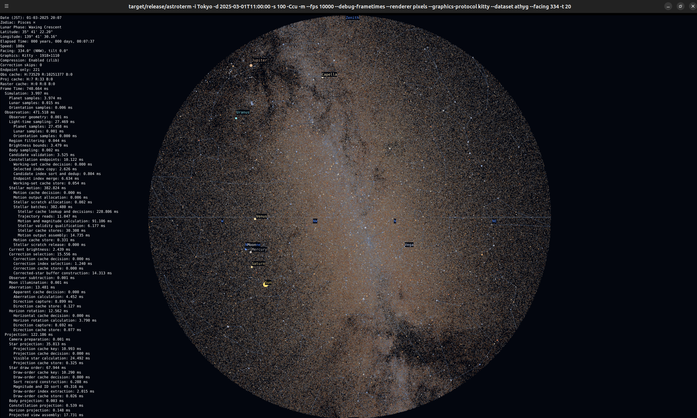
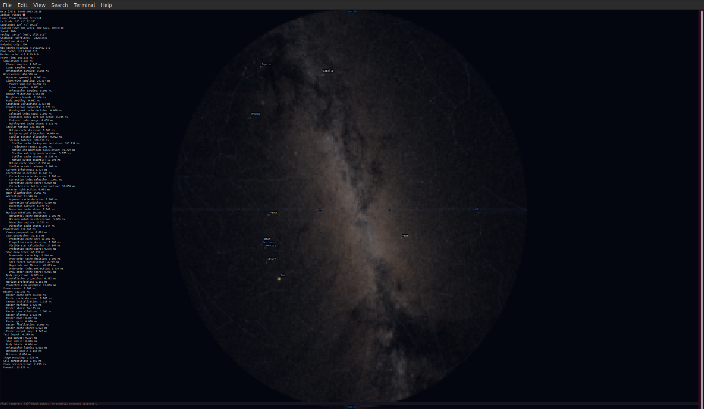
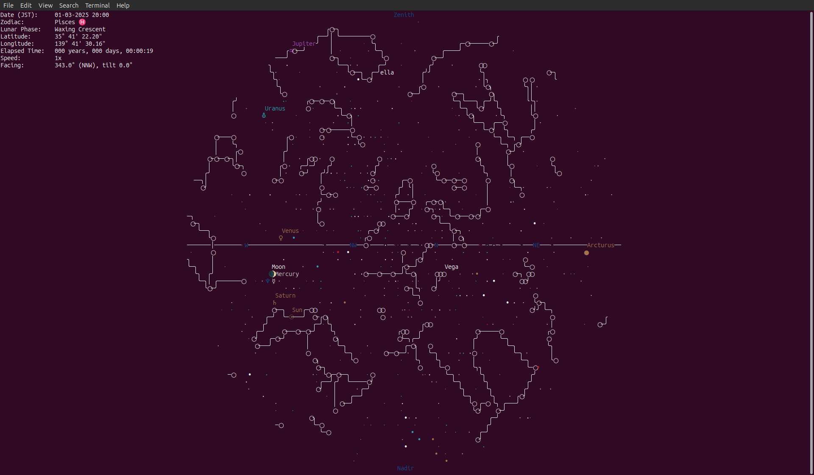
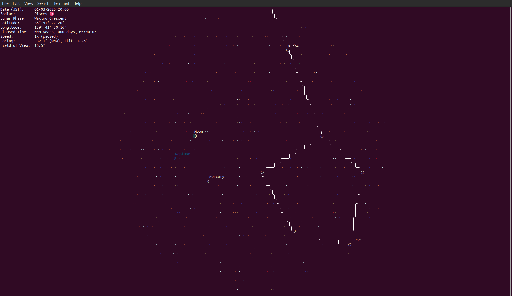

# astroterm-rs

A Rust port of astroterm with some extra stuff. 
A terminal star map showing stars, planets, the Moon, and constellations.

> [NOTE]  
> This code is ported from [astroterm](https://github.com/da-luce/astroterm) by  
> [da-luce](https://github.com/da-luce) (Dalton Luce), and further work on it is inspired by the original project.  
> All credit for the original design, algorithms and data preparation goes there.



*Pixel rendering with the AT-HYG catalog in Kitty.*

| Half-block graphics | Unicode characters | Unicode, zoomed in |
|---|---|---|
|  |  |  |

## Usage

With Rust and Cargo installed, run these commands from the project folder:

```sh
cargo build --release
./target/release/astroterm -i Tokyo -cCu -m
```

**Arrow keys look around, `+` / `-` zoom, Space pauses, and `q` quits.**

## More stars

The built-in Bright Star Catalog works offline without downloads. For about 2.5 million stars, use AT-HYG:

```sh
./target/release/astroterm -i Tokyo --dataset athyg -t 8 -cCu
```

## Views

```sh
# Pixel graphics instead of characters
./target/release/astroterm -i Tokyo --renderer pixels -C -m

# Look north-northwest, 20° above the horizon
./target/release/astroterm -i Tokyo --facing NNW --tilt 20 --fov 120 -cCu

# Freeze the sky at a specific date and time (UTC)
./target/release/astroterm -i Tokyo -d 2025-03-01T11:00:00 -s 0 -cCu -m

# Use coordinates instead of a city: latitude, then longitude
./target/release/astroterm -a 1.29 -o 103.85 -cCu
```

Without `--facing`, the view is centered overhead. Looking around with the arrow keys switches to a facing view.

Pixel mode detects Kitty, Sixel or iTerm2 support and falls back to colored half-blocks when needed.
If graphics look wrong, try `--graphics-protocol halfblocks`. To choose a supported protocol yourself,
use `--graphics-protocol kitty`, `sixel` or `iterm2`.

Use `--text-scale 0.7` for smaller pixel text or `--text-scale 1.2` for larger text
(default: `0.85`). This affects Kitty/Sixel/iTerm2 only; characters and half-blocks use your terminal's font size.

## Useful options

| Option | What it does |
|---|---|
| `-c`, `-u`, `-C` | Character colors, Unicode glyphs, constellation lines; combine as `-cCu` |
| `-m` | Show the date, location and simulation speed |
| `-s 100` | Run time 100× faster; `-s 0` starts paused |
| `-t 8` | Show fainter stars; default is `5`. Higher values show more stars and can be slower |
| `-l 2` | Label more stars; default is `0.25` |
| `--fov 60` | Zoom into a smaller patch of sky |
| `--fps 24` | Set the frame-rate target; defaults are 24 for characters and 12 for pixels |
| `-R` | Include atmospheric refraction near the horizon |

For all options: `./target/release/astroterm --help`.

Dates supplied with `-d` are UTC; the panel uses the observer's local time zone when available.
Dates use the Gregorian calendar throughout history, with year `0` meaning 1 BC and `-1` meaning 2 BC.
A yellow warning marks dates outside tested accuracy ranges. Drawn object sizes are schematic.

## Keys

| Key | Action |
|---|---|
| Arrows or `h` `j` `k` `l` | Look around |
| `+` / `-` | Zoom in / out |
| Space | Pause / resume |
| `]` / `[` | Speed up / slow down by 10× |
| `r` | Reverse time |
| `0` | Reset the view |
| `q`, Esc or Ctrl-C | Quit |


The first run downloads about **200 MB**; later runs reuse the file offline.
You can also supply a local AT-HYG CSV or compressed CSV: `--dataset ./athyg_40.csv.gz`.
Catalogs requiring special high-precision trajectories or near-zero-distance handling during preparation currently
stop with an explicit “not implemented” error; support for sparse star exceptions is pending.

On Linux, the default locations are:

- Download: `~/.local/share/astroterm/athyg_40.csv.gz`
- Prepared catalog cache: `~/.cache/astroterm/`

`XDG_DATA_HOME` and `XDG_CACHE_HOME` override these locations. The cache can be deleted while the app is closed;
it will be rebuilt from the dataset.

<details>
<summary>Optional setup and diagnostics</summary>

Enable Bash completions for the current shell:

```sh
source <(./target/release/astroterm --bash-completions)
```

- `--debug-frametimes`: show the time spent calculating and drawing each frame.
- `--debug-singleframe`: display one frame, then exit and print a detailed timing report.
- Memory inspection: see [memory diagnostics](docs/memory-diagnostics.md) for the optional build feature and reports.
- `--disable-cache`: recalculate runtime results every frame; keeps downloaded files and the catalog cache.
- `--cache-config <path>`: use custom reuse settings; see [examples/cache.toml](examples/cache.toml).

</details>

## Differences from the C version

Catalog brightness is stored in steps of 0.001 magnitude; values very close to a display threshold may round across it.
Stars are filtered by their catalog-epoch sky regions with a fixed motion allowance. At distant dates, fast-moving
stars may be missing from a view; special handling for them is currently deferred.
Stellar direction and brightness are cached by region for up to 10 simulated days by default. Use
`--disable-cache` for fresh calculations every frame, or shorten `stellar_state` in the [cache configuration](examples/cache.toml).

This port adds pixel graphics, interactive pan/zoom/time controls and optional AT-HYG downloads. It also improves
astronomical calculations, curved constellation lines, date handling and observer-local time display.
The five brightest visible stars get labels, using a proper name or catalog identifier. Sun, planet and Moon
labels are independent. Use `--disable-dynamic-names` to hide star labels; the former `--label-thresh` option has
been removed. Independent accuracy checks are documented in
[scripts/reference/README.md](scripts/reference/README.md).

In pixel mode, stars use equal-size four-pixel dots; overlapping stars blend and zooming in boosts their brightness.
Stars whose complete dot would cross the image boundary are omitted. The Sun, planets and Moon retain their sizes.
The interactive renderer draws stars dimmest-first within each sky region, with constellation stars last;
cross-region overlaps follow that region order. The five brightest star labels are still chosen across the whole view.

<details>
<summary>Credits, citations and data sources</summary>

## Citations

Resources used by the original astroterm and this port:

- [astroterm](https://github.com/da-luce/astroterm) by Dalton Luce, the project this code is ported from
- [Map Projections - A Working Manual by John P. Snyder](https://pubs.usgs.gov/pp/1395/report.pdf)
- [Wikipedia](https://en.wikipedia.org)
- [Atractor](https://www.atractor.pt/index-_en.html)
- [Jon Voisey's Blog: Following Kepler](https://jonvoisey.net/blog/)
- [Celestial Programming: Greg Miller's Astronomy Programming Page](https://astrogreg.com/convert_ra_dec_to_alt_az.html)
- [Practical Astronomy with your Calculator by Peter Duffett-Smith](https://www.amazon.com/Practical-Astronomy-Calculator-Peter-Duffett-Smith/dp/0521356997)
- Astronomical Algorithms by Jean Meeus
- [NASA Jet Propulsion Laboratory](https://ssd.jpl.nasa.gov/planets/approx_pos.html)
- [Paul Schlyter's "How to compute planetary positions"](https://stjarnhimlen.se/comp/ppcomp.html)
- [Dan Smith's "Meeus Solar Position Calculations"](https://observablehq.com/@danleesmith/meeus-solar-position-calculations)
- [Bryan Weber's "Orbital Mechanics Notes"](https://github.com/bryanwweber/orbital-mechanics-notes)
- [ASCOM](https://ascom-standards.org/Help/Developer/html/72A95B28-BBE2-4C7D-BC03-2D6AB324B6F7.htm)

Additional accuracy-model sources:

- [Bretagnon & Francou (1988), VSOP87](https://ui.adsabs.harvard.edu/abs/1988A%26A...202..309B/abstract),
  through the [VSOP87E Rust implementation](https://docs.rs/vsop87/3.0.0/vsop87/vsop87e/).
- [Vondrák, Capitaine & Wallace (2011/2012), long-term precession](https://www.aanda.org/articles/aa/abs/2011/10/aa17274-11/aa17274-11.html).
- [ERFA](https://github.com/liberfa/erfa): long-term pole and IAU 2000B nutation coefficients; translated code is
  covered by [LICENSE-ERFA](LICENSE-ERFA), with its SOFA heritage acknowledged there.
- [Espenak–Meeus ΔT polynomials](https://eclipse.gsfc.nasa.gov/SEcat5/deltatpoly.html).
- Jean Meeus, *Astronomical Algorithms*, second edition, chapters 22 and 47 (lunar tables 47.A/B).
- [WGS84](https://earth-info.nga.mil/index.php?dir=wgs84&action=wgs84): equatorial radius 6378137 m,
  inverse flattening 298.257223563, height 0.
- [JPL DE440/DE441](https://ssd.jpl.nasa.gov/planets/eph_export.html) and
  [Horizons](https://ssd.jpl.nasa.gov/horizons/manual.html) for independent comparisons.

## Data Sources

The files in `data/` are taken from the original astroterm repository:

- Stars: [Yale Bright Star Catalog](http://tdc-www.harvard.edu/catalogs/bsc5.html)
- Star names: [IAU Star Names](https://www.iau.org/public/themes/naming_stars/)
- Constellation figures: [Stellarium](https://github.com/Stellarium/stellarium/blob/3c8d3c448f82848e9d8c1af307ec4cad20f2a9c0/skycultures/modern/constellationship.fab#L6)
  (converted from [Hipparcos](https://heasarc.gsfc.nasa.gov/w3browse/all/hipparcos.html) to
  [BSC5](http://tdc-www.harvard.edu/catalogs/bsc5.html) indices using the
  [HYG Database](https://www.astronexus.com/projects/hyg), see astroterm's
  [convert_constellations.py](https://github.com/da-luce/astroterm/blob/main/scripts/convert_constellations.py))
- Cities: [GeoNames](https://download.geonames.org/) (filtered and condensed using astroterm's
  [filter_cities.py](https://github.com/da-luce/astroterm/blob/main/scripts/filter_cities.py))
- Time-zone boundaries: [timezone-boundary-builder](https://github.com/evansiroky/timezone-boundary-builder),
  derived from © [OpenStreetMap contributors](https://www.openstreetmap.org/copyright), distributed through
  [tzf-dist](https://github.com/ringsaturn/tzf-dist) under the [ODbL 1.0](https://opendatacommons.org/licenses/odbl/1-0/).
- Planet orbital elements: [NASA Jet Propulsion Laboratory](https://ssd.jpl.nasa.gov/planets/approx_pos.html)

Optional, not distributed with this repository:

- Larger star dataset for `--dataset`: [AT-HYG](https://codeberg.org/astronexus/athyg) (Augmented Tycho-HYG) by
  David Nash / astronexus, about 2.5 million stars from Tycho-2, Gaia DR3 and HYG, licensed
  [CC BY-SA 4.0](https://creativecommons.org/licenses/by-sa/4.0/). `--dataset athyg` downloads the pinned v4.0 file
  from its [Git LFS media URL](https://codeberg.org/astronexus/athyg/media/branch/main/data/athyg_40.csv.gz) into the
  per-user data folder. Manual copies can be placed anywhere, including the gitignored `datasets/` folder.

</details>

## License

MIT, see [LICENSE](./LICENSE). The original copyright notice of astroterm is kept there.

The unmodified bundled [DejaVu Sans Mono](https://dejavu-fonts.github.io/) font is distributed under its
[Bitstream Vera/DejaVu license](data/fonts/LICENSE-DejaVu.txt); its license notice is also embedded in the font file.
